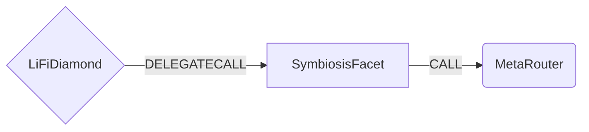

# Symbiosis Facet

## How it works

The Symbiosis Facet works by forwarding Symbiosis specific calls to the MetaRouter contract.



## Public Methods

- `function startBridgeTokensViaSymbiosis(BridgeData memory _bridgeData, SymbiosisData calldata _symbiosisData)`
  - Simply bridges tokens using Symbiosis
- `function swapAndStartBridgeTokensViaSymbiosis(BridgeData memory _bridgeData, LibSwap.SwapData[] calldata _swapData, SymbiosisData calldata _symbiosisData)`
  - Performs swap(s) before bridging tokens using Symbiosis

## Symbiosis Specific Parameters

Some methods listed above take a variable labeled `_symbiosisData`. This data is specific to Symbiosis and is represented as the following struct type:

```solidity
/// @param firstSwapCalldata payload for the first swap on the source chain.
/// @param secondSwapCalldata payload for the second swap on the source chain.
/// @param intermediateToken the address of the source token for the second swap.
/// @param bridgingToken the address of the dest token for the second swap.
/// @param firstDexRouter address of the first (uni-)dex on the source chain.
/// @param secondDexRouter address of the second (stable-)dex on the source chain.
/// @param relayRecipient burn-contract (Synthesis) or synth-contract (Portal) on the source chain for burn and synth schemes respectively.
/// @param otherSideCalldata payload for the call on the dest chain (metaBurnSyntheticToken for burn scheme or metaSynthesize for synth scheme).

struct SymbiosisData {
  bytes firstSwapCalldata;
  bytes secondSwapCalldata;
  address intermediateToken;
  address bridgingToken;
  address firstDexRouter;
  address secondDexRouter;
  address relayRecipient;
  bytes otherSideCalldata;
}
```

## Swap Data

Some methods accept a `SwapData _swapData` parameter.

Swapping is performed by a swap specific library that expects an array of calldata to can be run on various DEXs (i.e. Uniswap) to make one or multiple swaps before performing another action.

The swap library can be found [here](../src/Libraries/LibSwap.sol).

## LiFi Data

Some methods accept a `BridgeData _bridgeData` parameter.

This parameter is strictly for analytics purposes. It's used to emit events that we can later track and index in our subgraphs and provide data on how our contracts are being used. `BridgeData` and the events we can emit can be found [here](../src/Interfaces/ILiFi.sol).

## Getting Symbiosis Calldata


For that user should go to  [/quote endpoint](https://api-v2.symbiosis.finance/crosschain/docs/#/Swapping/post_v1_swapping_exact_in)

Example of POST request to API USDC(Ethereum) -> BNB (BNB chain)

```
{
  "tokenAmountIn": {
    "address": "0xA0b86991c6218b36c1d19D4a2e9Eb0cE3606eB48",
    "chainId": 1,
    "symbol": "USDC",
    "decimals": 6,
    "amount": "100000000"
  },
  "tokenOut": {
    "chainId": 56,
    "address": "",
    "symbol": "BNB",
    "decimals": 18
  },
  "to": "0xf93d011544e89a28b5bdbdd833016cc5f26e82cd",
  "from": "0xf93d011544e89a28b5bdbdd833016cc5f26e82cd",
  "revertableAddress": "0xf93d011544e89a28b5bdbdd833016cc5f26e82cd",
  "slippage": 300,
  "deadline": 2000000000
}
```

###Response result
```
{
  "fee": {
    "symbol": "BUSD",
    "icon": "https://s2.coinmarketcap.com/static/img/coins/64x64/4687.png",
    "address": "0xe9e7CEA3DedcA5984780Bafc599bD69ADd087D56",
    "amount": "750000000000000000",
    "chainId": 56,
    "decimals": 18
  },
  "priceImpact": "-0.01",
  "tokenAmountOut": {
    "symbol": "BNB",
    "icon": "https://s2.coinmarketcap.com/static/img/coins/64x64/1839.png",
    "address": "",
    "amount": "398882787580482273",
    "chainId": 56,
    "decimals": 18
  },
  "tx": {
    "chainId": 1,
    "data": "0xa11b119800000000000000000000000000000000000000000000000000000000000000200000000000000000000000000000000000000000000000000000000000000120000000000000000000000000000000000000000000000000000000000000014000000000000000000000000000000000000000000000000000000000000001600000000000000000000000000000000000000000000000000000000000000000000000000000000000000000cb28fbe3e9c0fea62e0e63ff3f232cecfe555ad40000000000000000000000000000000000000000000000000000000005f5e1000000000000000000000000000000000000000000000000000000000000000000000000000000000000000000b8f275fbf7a959f4bce59999a2ef122a099e81a800000000000000000000000000000000000000000000000000000000000001c0000000000000000000000000000000000000000000000000000000000000000000000000000000000000000000000000000000000000000000000000000000000000000000000000000000000000000000000000000000000000000000000002000000000000000000000000a0b86991c6218b36c1d19d4a2e9eb0ce3606eb48000000000000000000000000a0b86991c6218b36c1d19d4a2e9eb0ce3606eb480000000000000000000000000000000000000000000000000000000000000b24ce654c170000000000000000000000000000000000000000000000000000000000000020000000000000000000000000000000000000000000000000000000000003d0900000000000000000000000000000000000000000000000000000000005f5e100000000000000000000000000a0b86991c6218b36c1d19d4a2e9eb0ce3606eb48000000000000000000000000f93d011544e89a28b5bdbdd833016cc5f26e82cd000000000000000000000000b8f275fbf7a959f4bce59999a2ef122a099e81a80000000000000000000000005523985926aa12ba58dc5ad00ddca99678d7227e000000000000000000000000f93d011544e89a28b5bdbdd833016cc5f26e82cd000000000000000000000000000000000000000000000000000000000000dbe00000000000000000000000000000000000000000000000000000000000000200000000000000000000000000cb28fbe3e9c0fea62e0e63ff3f232cecfe555ad40000000000000000000000000000000000000000000000000000000000000260000000000000000000000000b8f275fbf7a959f4bce59999a2ef122a099e81a800000000000000000000000000000000000000000000000000000000000005800000000000000000000000000000000000000000000000000000000000000064000000000000000000000000f93d011544e89a28b5bdbdd833016cc5f26e82cd73796d62696f7369732d6170690000000000000000000000000000000000000000000000000000000000000000000000000000000000000000000000000000020000000000000000000000007d6ec42b5d9566931560411a8652cea00b90d9820000000000000000000000001a25beb8e75626addb983d46fbdfce5fdc29ae5800000000000000000000000000000000000000000000000000000000000002e41e859a050000000000000000000000000000000000000000000000000000000005f5e10000000000000000000000000000000000000000000000000000000000000000c00000000000000000000000000000000000000000000000000000000000000200000000000000000000000000000000000000000000000000000000000000024000000000000000000000000000000000000000000000000000000000000002a0000000000000000000000000b79a4f5828eb55c10d7abf4bfe9a9f5d11aa84e00000000000000000000000000000000000000000000000000000000000000001000000000000000000000000000000000000000000000000000000000000002000000000000000000000000000000000000000000000000000000000000000c48f6bdeaa000000000000000000000000000000000000000000000000000000000000000000000000000000000000000000000000000000000000000000000000000000010000000000000000000000000000000000000000000000000000000005f2107000000000000000000000000000000000000000000000000561b93e02d5609b13000000000000000000000000b79a4f5828eb55c10d7abf4bfe9a9f5d11aa84e000000000000000000000000000000000000000000000000000000000773594000000000000000000000000000000000000000000000000000000000000000000000000000000000000000000000000000000000000000000000000010000000000000000000000006148fd6c649866596c3d8a971fc313e5ece8488200000000000000000000000000000000000000000000000000000000000000020000000000000000000000007d6ec42b5d9566931560411a8652cea00b90d9820000000000000000000000001a25beb8e75626addb983d46fbdfce5fdc29ae5800000000000000000000000000000000000000000000000000000000000000010000000000000000000000000000000000000000000000000000000000000064000000000000000000000000000000000000000000000000000000000000000000000000000000000000000000000000000000000000000000000544e691a2aa00000000000000000000000000000000000000000000000000000000000000200000000000000000000000000000000000000000000000000a688906bd8b0000000000000000000000000000000000000000000000000005689cba7b2aec9bda000000000000000000000000b79a4f5828eb55c10d7abf4bfe9a9f5d11aa84e00000000000000000000000001111111254eeb25477b68fb85ed929f73a9605820000000000000000000000001a25beb8e75626addb983d46fbdfce5fdc29ae5800000000000000000000000000000000000000000000000000000000000001a000000000000000000000000000000000000000000000000000000000000000c4000000000000000000000000f93d011544e89a28b5bdbdd833016cc5f26e82cd0000000000000000000000005aa5f7f84ed0e5db0a4a85c3947ea16b53352fd4000000000000000000000000b8f275fbf7a959f4bce59999a2ef122a099e81a8000000000000000000000000f93d011544e89a28b5bdbdd833016cc5f26e82cd000000000000000000000000000000000000000000000000000000000000003873796d62696f7369732d61706900000000000000000000000000000000000000000000000000000000000000000000000000000000000000000000000000034812aa3caf000000000000000000000000170d2ed0b2a5d9f450652be814784f964749ffa4000000000000000000000000e9e7cea3dedca5984780bafc599bd69add087d56000000000000000000000000eeeeeeeeeeeeeeeeeeeeeeeeeeeeeeeeeeeeeeee000000000000000000000000170d2ed0b2a5d9f450652be814784f964749ffa4000000000000000000000000f93d011544e89a28b5bdbdd833016cc5f26e82cd0000000000000000000000000000000000000000000000055e3431746d619bda0000000000000000000000000000000000000000000000000565b03cc53bc268000000000000000000000000000000000000000000000000000000000000000400000000000000000000000000000000000000000000000000000000000001400000000000000000000000000000000000000000000000000000000000000160000000000000000000000000000000000000000000000000000000000000000000000000000000000000000000000000000000000000000000000000000001ba00000000000000000000000000000000000000019c00018600014a00001a0020d6bdbf78e9e7cea3dedca5984780bafc599bd69add087d565120830c9e0295730bbb220bd78346c6499ff37851fbe9e7cea3dedca5984780bafc599bd69add087d5600a4a5dcbcdf000000000000000000000000e9e7cea3dedca5984780bafc599bd69add087d56000000000000000000000000bb4cdb9cbd36b01bd1cbaebf2de08d9173bc095c0000000000000000000000002c93437fa01c0123ed21e8b862762c887c119513000000000000000000000000170d2ed0b2a5d9f450652be814784f964749ffa4ffffffffffffffffffffffffffffffffffffffffffffffffffffffffffffffff0000000000000000000000000000000000000000000000000000000000000000000000000000000000000000000000000000000000000000000000000000000000000000000000000000000000000000000000000000000000000000000000004101bb4cdb9cbd36b01bd1cbaebf2de08d9173bc095c00042e1a7d4d0000000000000000000000000000000000000000000000000000000000000000c0611111111254eeb25477b68fb85ed929f73a960582000000000000ea698b470000000000000000000000000000000000000000000000000000000000000000000000000000000000000000000000000000000000000000000000000000000000000000000000000000000000000000",
    "to": "0xE75C7E85FE6ADd07077467064aD15847E6ba9877"
  },
  "amountInUsd": {
    "symbol": "USDC",
    "icon": "https://s2.coinmarketcap.com/static/img/coins/64x64/3408.png",
    "address": "0xA0b86991c6218b36c1d19D4a2e9Eb0cE3606eB48",
    "amount": "100000000",
    "chainId": 1,
    "decimals": 6
  },
  "approveTo": "0x25bEE8C21D1d0ec2852302fd7E674196EA298eC6",
  "route": [
    {
      "symbol": "USDC",
      "icon": "https://s2.coinmarketcap.com/static/img/coins/64x64/3408.png",
      "address": "0xA0b86991c6218b36c1d19D4a2e9Eb0cE3606eB48",
      "chainId": 1,
      "decimals": 6
    },
    {
      "symbol": "sUSDC",
      "icon": "https://s2.coinmarketcap.com/static/img/coins/64x64/3408.png",
      "address": "0x7d6EC42b5d9566931560411a8652Cea00b90d982",
      "chainId": 56288,
      "decimals": 6
    },
    {
      "symbol": "sBUSD",
      "icon": "https://s2.coinmarketcap.com/static/img/coins/64x64/4687.png",
      "address": "0x1a25BEB8E75626ADDb983d46fbDfcE5fdC29Ae58",
      "chainId": 56288,
      "decimals": 18
    },
    {
      "symbol": "BUSD",
      "icon": "https://s2.coinmarketcap.com/static/img/coins/64x64/4687.png",
      "address": "0xe9e7CEA3DedcA5984780Bafc599bD69ADd087D56",
      "chainId": 56,
      "decimals": 18
    },
    {
      "symbol": "BNB",
      "icon": "https://s2.coinmarketcap.com/static/img/coins/64x64/1839.png",
      "address": "",
      "chainId": 56,
      "decimals": 18
    }
  ]
}
```
