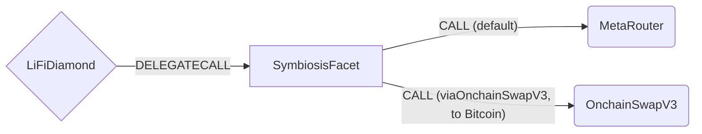

# Symbiosis Facet

## How it works

The Symbiosis Facet forwards Symbiosis-specific calls to one of two routers:

- the **MetaRouter** for classic cross-chain swaps through Symbiosis pools (default), or
- the **OnchainSwapV3** router for swaps from a syBTC-connector chain to Bitcoin, where
  Symbiosis bypasses the MetaRouter and burns syBTC to release BTC.

The path is selected by the caller via the `viaOnchainSwapV3` flag in `SymbiosisData`.
When it is set, the facet requires the destination to be Bitcoin and the OnchainSwapV3
router to be configured on the source chain, so a wrongly-set flag reverts rather than
misdirecting funds.

### Trust assumption on the OnchainSwapV3 path

On the OnchainSwapV3 path the final Bitcoin receiver lives in `nonEvmReceiver`, and
`dex` / `dexgateway` / `onchainSwapData` are **caller-supplied** and forwarded into the
trusted OnchainSwapV3 router. These cannot be validated purely on-chain against
`bridgeData.receiver`, so the path is gated by an **EIP-712 backend signature**: the LI.FI
backend signs a payload binding `transactionId`, `minAmount`, `sendingAssetId`,
`destinationChainId`, `nonEvmReceiver`, `dex`, `dexgateway`, `keccak256(onchainSwapData)`
and `deadline`, and the facet verifies it against the configured `backendSigner`
(`config/global.json .backendSigner`). Each `transactionId` is single-use (replay-proof),
and expired signatures revert. Integrators must therefore obtain the `signature` and
`deadline` from the LI.FI backend for this path — a self-constructed OnchainSwapV3 call
cannot pass verification. The MetaRouter path carries no signature and is unchanged.


```mermaid
graph LR;
    D{LiFiDiamond}-- DELEGATECALL -->SymbiosisFacet;
    SymbiosisFacet -- "CALL (default)" --> C(MetaRouter)
    SymbiosisFacet -- "CALL (viaOnchainSwapV3, to Bitcoin)" --> O(OnchainSwapV3)
```

## Public Methods

- `function startBridgeTokensViaSymbiosis(BridgeData memory _bridgeData, SymbiosisData calldata _symbiosisData)`
  - Simply bridges tokens using Symbiosis
- `function swapAndStartBridgeTokensViaSymbiosis(BridgeData memory _bridgeData, LibSwap.SwapData[] calldata _swapData, SymbiosisData calldata _symbiosisData)`
  - Performs swap(s) before bridging tokens using Symbiosis

## Symbiosis Specific Parameters

Some methods listed above take a variable labeled `_symbiosisData`. This data is specific to Symbiosis and is represented as the following struct type:

```solidity
/// @param nonEvmReceiver the Bitcoin receiver, emitted for non-EVM destinations.
/// @param firstSwapCalldata payload for the first swap on the source chain (MetaRouter path).
/// @param secondSwapCalldata payload for the second swap on the source chain (MetaRouter path).
/// @param intermediateToken the intermediate token used for swapping (MetaRouter path).
/// @param firstDexRouter address of the first (uni-)dex on the source chain (MetaRouter path).
/// @param secondDexRouter address of the second (stable-)dex on the source chain (MetaRouter path).
/// @param approvedTokens the tokens approved for swapping (MetaRouter path).
/// @param callTo the bridging entrypoint / relayRecipient (MetaRouter path).
/// @param callData the bridging calldata / otherSideCalldata (MetaRouter path).
/// @param viaOnchainSwapV3 when true, route via the OnchainSwapV3 router (syBTC -> Bitcoin) instead of the MetaRouter.
/// @param dex the DEX router for the OnchainSwapV3 input-token -> syBTC swap.
/// @param dexgateway the spender the DEX is approved through for that swap.
/// @param onchainSwapData the Symbiosis-provided calldata for the OnchainSwapV3 inner swap/burn.
/// @param deadline OnchainSwapV3 only: expiry of the backend signature.
/// @param signature OnchainSwapV3 only: backend EIP-712 signature over the payload.

struct SymbiosisData {
  bytes32 nonEvmReceiver;
  bytes firstSwapCalldata;
  bytes secondSwapCalldata;
  address intermediateToken;
  address firstDexRouter;
  address secondDexRouter;
  address[] approvedTokens;
  address callTo;
  bytes callData;
  bool viaOnchainSwapV3;
  address dex;
  address dexgateway;
  bytes onchainSwapData;
  uint256 deadline;
  bytes signature;
}
```

## Swap Data

Some methods accept a `SwapData _swapData` parameter.

Swapping is performed by a swap specific library that expects an array of calldata to can be run on various DEXs (i.e. Uniswap) to make one or multiple swaps before performing another action.

The swap library can be found [here](../src/Libraries/LibSwap.sol).

## LiFi Data

Some methods accept a `BridgeData _bridgeData` parameter.

This parameter is strictly for analytics purposes. It's used to emit events that we can later track and index in our subgraphs and provide data on how our contracts are being used. `BridgeData` and the events we can emit can be found [here](../src/Interfaces/ILiFi.sol).

## Getting Symbiosis Calldata


For that user should go to  [/quote endpoint](https://api-v2.symbiosis.finance/crosschain/docs/#/Swapping/post_v1_swapping_exact_in)

Example of POST request to API USDC(Ethereum) -> BNB (BNB chain)

```
{
  "tokenAmountIn": {
    "address": "0xA0b86991c6218b36c1d19D4a2e9Eb0cE3606eB48",
    "chainId": 1,
    "symbol": "USDC",
    "decimals": 6,
    "amount": "100000000"
  },
  "tokenOut": {
    "chainId": 56,
    "address": "",
    "symbol": "BNB",
    "decimals": 18
  },
  "to": "0xf93d011544e89a28b5bdbdd833016cc5f26e82cd",
  "from": "0xf93d011544e89a28b5bdbdd833016cc5f26e82cd",
  "revertableAddress": "0xf93d011544e89a28b5bdbdd833016cc5f26e82cd",
  "slippage": 300,
  "deadline": 2000000000
}
```

### Response result

```
{
  "fee": {
    "symbol": "BUSD",
    "icon": "https://s2.coinmarketcap.com/static/img/coins/64x64/4687.png",
    "address": "0xe9e7CEA3DedcA5984780Bafc599bD69ADd087D56",
    "amount": "750000000000000000",
    "chainId": 56,
    "decimals": 18
  },
  "priceImpact": "-0.01",
  "tokenAmountOut": {
    "symbol": "BNB",
    "icon": "https://s2.coinmarketcap.com/static/img/coins/64x64/1839.png",
    "address": "",
    "amount": "398882787580482273",
    "chainId": 56,
    "decimals": 18
  },
  "tx": {
    "chainId": 1,
    "data": "0xa11b119800000000000000000000000000000000000000000000000000000000000000200000000000000000000000000000000000000000000000000000000000000120000000000000000000000000000000000000000000000000000000000000014000000000000000000000000000000000000000000000000000000000000001600000000000000000000000000000000000000000000000000000000000000000000000000000000000000000cb28fbe3e9c0fea62e0e63ff3f232cecfe555ad40000000000000000000000000000000000000000000000000000000005f5e1000000000000000000000000000000000000000000000000000000000000000000000000000000000000000000b8f275fbf7a959f4bce59999a2ef122a099e81a800000000000000000000000000000000000000000000000000000000000001c0000000000000000000000000000000000000000000000000000000000000000000000000000000000000000000000000000000000000000000000000000000000000000000000000000000000000000000000000000000000000000000000002000000000000000000000000a0b86991c6218b36c1d19d4a2e9eb0ce3606eb48000000000000000000000000a0b86991c6218b36c1d19d4a2e9eb0ce3606eb480000000000000000000000000000000000000000000000000000000000000b24ce654c170000000000000000000000000000000000000000000000000000000000000020000000000000000000000000000000000000000000000000000000000003d0900000000000000000000000000000000000000000000000000000000005f5e100000000000000000000000000a0b86991c6218b36c1d19d4a2e9eb0ce3606eb48000000000000000000000000f93d011544e89a28b5bdbdd833016cc5f26e82cd000000000000000000000000b8f275fbf7a959f4bce59999a2ef122a099e81a80000000000000000000000005523985926aa12ba58dc5ad00ddca99678d7227e000000000000000000000000f93d011544e89a28b5bdbdd833016cc5f26e82cd000000000000000000000000000000000000000000000000000000000000dbe00000000000000000000000000000000000000000000000000000000000000200000000000000000000000000cb28fbe3e9c0fea62e0e63ff3f232cecfe555ad40000000000000000000000000000000000000000000000000000000000000260000000000000000000000000b8f275fbf7a959f4bce59999a2ef122a099e81a800000000000000000000000000000000000000000000000000000000000005800000000000000000000000000000000000000000000000000000000000000064000000000000000000000000f93d011544e89a28b5bdbdd833016cc5f26e82cd73796d62696f7369732d6170690000000000000000000000000000000000000000000000000000000000000000000000000000000000000000000000000000020000000000000000000000007d6ec42b5d9566931560411a8652cea00b90d9820000000000000000000000001a25beb8e75626addb983d46fbdfce5fdc29ae5800000000000000000000000000000000000000000000000000000000000002e41e859a050000000000000000000000000000000000000000000000000000000005f5e10000000000000000000000000000000000000000000000000000000000000000c00000000000000000000000000000000000000000000000000000000000000200000000000000000000000000000000000000000000000000000000000000024000000000000000000000000000000000000000000000000000000000000002a0000000000000000000000000b79a4f5828eb55c10d7abf4bfe9a9f5d11aa84e00000000000000000000000000000000000000000000000000000000000000001000000000000000000000000000000000000000000000000000000000000002000000000000000000000000000000000000000000000000000000000000000c48f6bdeaa000000000000000000000000000000000000000000000000000000000000000000000000000000000000000000000000000000000000000000000000000000010000000000000000000000000000000000000000000000000000000005f2107000000000000000000000000000000000000000000000000561b93e02d5609b13000000000000000000000000b79a4f5828eb55c10d7abf4bfe9a9f5d11aa84e000000000000000000000000000000000000000000000000000000000773594000000000000000000000000000000000000000000000000000000000000000000000000000000000000000000000000000000000000000000000000010000000000000000000000006148fd6c649866596c3d8a971fc313e5ece8488200000000000000000000000000000000000000000000000000000000000000020000000000000000000000007d6ec42b5d9566931560411a8652cea00b90d9820000000000000000000000001a25beb8e75626addb983d46fbdfce5fdc29ae5800000000000000000000000000000000000000000000000000000000000000010000000000000000000000000000000000000000000000000000000000000064000000000000000000000000000000000000000000000000000000000000000000000000000000000000000000000000000000000000000000000544e691a2aa00000000000000000000000000000000000000000000000000000000000000200000000000000000000000000000000000000000000000000a688906bd8b0000000000000000000000000000000000000000000000000005689cba7b2aec9bda000000000000000000000000b79a4f5828eb55c10d7abf4bfe9a9f5d11aa84e00000000000000000000000001111111254eeb25477b68fb85ed929f73a9605820000000000000000000000001a25beb8e75626addb983d46fbdfce5fdc29ae5800000000000000000000000000000000000000000000000000000000000001a000000000000000000000000000000000000000000000000000000000000000c4000000000000000000000000f93d011544e89a28b5bdbdd833016cc5f26e82cd0000000000000000000000005aa5f7f84ed0e5db0a4a85c3947ea16b53352fd4000000000000000000000000b8f275fbf7a959f4bce59999a2ef122a099e81a8000000000000000000000000f93d011544e89a28b5bdbdd833016cc5f26e82cd000000000000000000000000000000000000000000000000000000000000003873796d62696f7369732d61706900000000000000000000000000000000000000000000000000000000000000000000000000000000000000000000000000034812aa3caf000000000000000000000000170d2ed0b2a5d9f450652be814784f964749ffa4000000000000000000000000e9e7cea3dedca5984780bafc599bd69add087d56000000000000000000000000eeeeeeeeeeeeeeeeeeeeeeeeeeeeeeeeeeeeeeee000000000000000000000000170d2ed0b2a5d9f450652be814784f964749ffa4000000000000000000000000f93d011544e89a28b5bdbdd833016cc5f26e82cd0000000000000000000000000000000000000000000000055e3431746d619bda0000000000000000000000000000000000000000000000000565b03cc53bc268000000000000000000000000000000000000000000000000000000000000000400000000000000000000000000000000000000000000000000000000000001400000000000000000000000000000000000000000000000000000000000000160000000000000000000000000000000000000000000000000000000000000000000000000000000000000000000000000000000000000000000000000000001ba00000000000000000000000000000000000000019c00018600014a00001a0020d6bdbf78e9e7cea3dedca5984780bafc599bd69add087d565120830c9e0295730bbb220bd78346c6499ff37851fbe9e7cea3dedca5984780bafc599bd69add087d5600a4a5dcbcdf000000000000000000000000e9e7cea3dedca5984780bafc599bd69add087d56000000000000000000000000bb4cdb9cbd36b01bd1cbaebf2de08d9173bc095c0000000000000000000000002c93437fa01c0123ed21e8b862762c887c119513000000000000000000000000170d2ed0b2a5d9f450652be814784f964749ffa4ffffffffffffffffffffffffffffffffffffffffffffffffffffffffffffffff0000000000000000000000000000000000000000000000000000000000000000000000000000000000000000000000000000000000000000000000000000000000000000000000000000000000000000000000000000000000000000000000004101bb4cdb9cbd36b01bd1cbaebf2de08d9173bc095c00042e1a7d4d0000000000000000000000000000000000000000000000000000000000000000c0611111111254eeb25477b68fb85ed929f73a960582000000000000ea698b470000000000000000000000000000000000000000000000000000000000000000000000000000000000000000000000000000000000000000000000000000000000000000000000000000000000000000",
    "to": "0xE75C7E85FE6ADd07077467064aD15847E6ba9877"
  },
  "amountInUsd": {
    "symbol": "USDC",
    "icon": "https://s2.coinmarketcap.com/static/img/coins/64x64/3408.png",
    "address": "0xA0b86991c6218b36c1d19D4a2e9Eb0cE3606eB48",
    "amount": "100000000",
    "chainId": 1,
    "decimals": 6
  },
  "approveTo": "0x25bEE8C21D1d0ec2852302fd7E674196EA298eC6",
  "route": [
    {
      "symbol": "USDC",
      "icon": "https://s2.coinmarketcap.com/static/img/coins/64x64/3408.png",
      "address": "0xA0b86991c6218b36c1d19D4a2e9Eb0cE3606eB48",
      "chainId": 1,
      "decimals": 6
    },
    {
      "symbol": "sUSDC",
      "icon": "https://s2.coinmarketcap.com/static/img/coins/64x64/3408.png",
      "address": "0x7d6EC42b5d9566931560411a8652Cea00b90d982",
      "chainId": 56288,
      "decimals": 6
    },
    {
      "symbol": "sBUSD",
      "icon": "https://s2.coinmarketcap.com/static/img/coins/64x64/4687.png",
      "address": "0x1a25BEB8E75626ADDb983d46fbDfcE5fdC29Ae58",
      "chainId": 56288,
      "decimals": 18
    },
    {
      "symbol": "BUSD",
      "icon": "https://s2.coinmarketcap.com/static/img/coins/64x64/4687.png",
      "address": "0xe9e7CEA3DedcA5984780Bafc599bD69ADd087D56",
      "chainId": 56,
      "decimals": 18
    },
    {
      "symbol": "BNB",
      "icon": "https://s2.coinmarketcap.com/static/img/coins/64x64/1839.png",
      "address": "",
      "chainId": 56,
      "decimals": 18
    }
  ]
}
```
