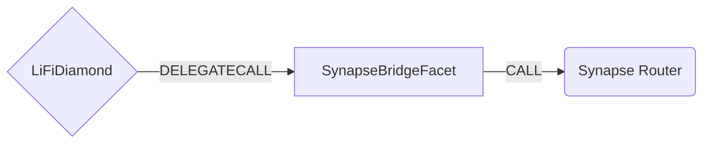

# Synapse Bridge Facet

## How it works

The Synapse Bridge Facet works by forwarding Synapse Bridge specific calls to Synapse Router [contract](https://github.com/synapsecns/synapse-contracts/blob/db6ee6736ea43a8f0698ae78c90229a27fadc759/contracts/bridge/router/SynapseRouter.sol). The Synapse Router is an overhaul of current Synapse Bridge contracts that abstracts much of the complexity around liquidity based bridging to one simple bridge() function. Previously, different functions would be used for different types of transactions which made it very complex to bridge at the contract level.



## Public Methods

- `function startBridgeTokensViaSynapseBridge(BridgeData calldata _bridgeData, SynapseData calldata _synapseData)`
  - Simply bridges tokens using Synapse Bridge
- `function swapAndStartBridgeTokensViaSynapseBridge(BridgeData memory _bridgeData, LibSwap.SwapData[] calldata _swapData, SynapseData calldata _synapseData)`
  - Performs swap(s) before bridging tokens using Synapse Bridge

## Synapse Bridge Specific Parameters

Some of the methods listed above take a variable labeled `_synapseData`.

To populate `originQuery` and `destQuery`, you need to call `getOriginAmountOut` and `getDestinationAmountOut` functions of SynapseRouter.

This data is specific to SynapseBridgeFacet and is represented as the following struct type:

```solidity
/// @param originQuery Origin swap query. Empty struct indicates no swap is required.
/// @param destQuery Destination swap query. Empty struct indicates no swap is required.
struct SynapseData {
  ISynapseRouter.SwapQuery originQuery;
  ISynapseRouter.SwapQuery destQuery;
}
```

## Swap Data

Some methods accept a `SwapData _swapData` parameter.

Swapping is performed by a swap specific library that expects an array of calldata to can be run on variaous DEXs (i.e. Uniswap) to make one or multiple swaps before performing another action.

The swap library can be found [here](../src/Libraries/LibSwap.sol).

## LiFi Data

Some methods accept a `BridgeData _bridgeData` parameter.

This parameter is strictly for analytics purposes. It's used to emit events that we can later track and index in our subgraphs and provide data on how our contracts are being used. `BridgeData` and the events we can emit can be found [here](../src/Interfaces/ILiFi.sol).

## Getting Sample Calls to interact with the Facet

In the following some sample calls are shown that allow you to retrieve a populated transaction that can be sent to our contract via your wallet.

All examples use our [/quote endpoint](https://apidocs.li.finance/reference/get_quote-1) to retrieve a quote which contains a `transactionRequest`. This request can directly be sent to your wallet to trigger the transaction.

The quote result looks like the following:

```javascript
const quoteResult = {
  id: '0x...', // quote id
  type: 'lifi', // the type of the quote (all lifi contract calls have the type "lifi")
  tool: 'synapse', // the bridge tool used for the transaction
  action: {}, // information about what is going to happen
  estimate: {}, // information about the estimated outcome of the call
  includedSteps: [], // steps that are executed by the contract as part of this transaction, e.g. a swap step and a cross step
  transactionRequest: {
    // the transaction that can be sent using a wallet
    data: '0x...',
    to: '0x...',
    value: '0x00',
    from: '{YOUR_WALLET_ADDRESS}',
    chainId: 100,
    gasLimit: '0x...',
    gasPrice: '0x...',
  },
}
```

A detailed explanation on how to use the /quote endpoint and how to trigger the transaction can be found [here](https://apidocs.li.finance/reference/how-to-transfer-tokens).

**Hint**: Don't forget to replace `{YOUR_WALLET_ADDRESS}` with your real wallet address in the examples.

### Cross Only

To get a transaction for a transfer from 20 USDC on Ethereum to USDC on Avalanche you can execute the following request:

```shell
curl 'https://li.quest/v1/quote?fromChain=ETH&fromAmount=20000000&fromToken=USDC&toChain=AVA&toToken=USDC&slippage=0.03&allowBridges=synapse&fromAddress={YOUR_WALLET_ADDRESS}'
```

### Swap & Cross

To get a transaction for a transfer from 10 USDT on Ethereum to USDC on Avalanche you can execute the following request:

```shell
curl 'https://li.quest/v1/quote?fromChain=ETH&fromAmount=10000000&fromToken=USDT&toChain=AVA&toToken=USDC&slippage=0.03&allowBridges=synapse&fromAddress={YOUR_WALLET_ADDRESS}'
```
