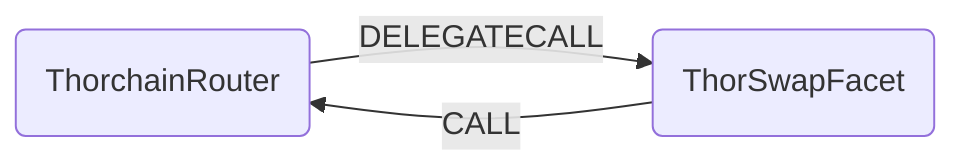

# ThorSwap Facet

## How it works

The ThorSwap bridge facet works by forwarding calls to the Thorchain router contract on the source chain. Quotes are obtained using the ThorSwap API.

THORSwap is a multi-chain DEX aggregator built on THORChain's cross-chain liquidity protocol and the #1 interface for all THORChain services such as Savers, liquidity providing, THORNames, Synthetic Assets & THORSafe multisig wallets. In our belief that the future is multi-chain, THORSwap developed a secure solution to remove technical barriers for trading any assets accross chains, without relying on wrapped assets or bridges.



## Public Methods

- `function startBridgeTokensViaThorSwap(BridgeData calldata _bridgeData, ThorSwapData calldata _thorSwapData)`
  - Simply bridges tokens using ThorSwapFacet
- `function swapAndStartBridgeTokensViaThorSwap(BridgeData memory _bridgeData, LibSwap.SwapData[] calldata _swapData, ThorSwapData calldata _thorSwapData)`
  - Performs swap(s) before bridging tokens using bridgeFacet

## Bridge Specific Parameters

Some of the methods listed above take a variable labeled `_thorSwapData`.

This data is specific to ThorSwap and is represented as the following struct type:

```solidity
/// @notice The struct for the ThorSwap data.
/// @param vault The Thorchain vault address
/// @param memo The memo to send to Thorchain for the swap
/// @param expiration The expiration time for the swap
struct ThorSwapData {
    address vault;
    string memo;
    uint256 expiration;
}
```

## Swap Data

Some methods accept a `SwapData _swapData` parameter.

Swapping is performed by a swap specific library that expects an array of calldata to can be run on variaous DEXs (i.e. Uniswap) to make one or multiple swaps before performing another action.

The swap library can be found [here](../src/Libraries/LibSwap.sol).

## LiFi Data

Most of the methods accept a `ILiFiBridgeData _bridgeData` parameter.

In the ThorSwap contract call the fields `minAmount` and `sendingAssetId` are used for the transfer amount and the asset to be sent. Since the ThorSwap bridge does not support native token bridging (it's mainly a stablecoin bridge) the methods will fail if native assets are tried to be bridged.

It's also used to emit events that we can later track and index in our subgraphs and provide data on how our contracts are being used. `BridgeData` and the events we can emit can be found [here](../src/Interfaces/ILiFi.sol).

## Getting Sample Calls to interact with the Facet

In the following some sample calls are shown that allow you to retrieve a populated transaction that can be sent to our contract
