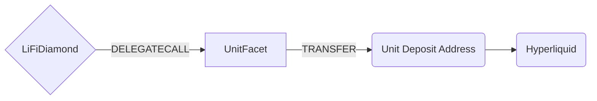

# Unit Facet

## How it works

The Unit Facet enables bridging of native tokens from various chains to hyperliquid through the Unit bridge. It uses EIP-712 signatures for secure transaction backend authorization and supports both direct bridging and swap-then-bridge operations.



## Public Methods

- `function startBridgeTokensViaUnit(BridgeData calldata _bridgeData, UnitData calldata _unitData)`
  - Bridges native tokens directly using Unit protocol
  - Requires EIP-712 signature verification
  - Only accepts native tokens (ETH/XPL)
  - Only bridges to Hyperliquid (LIFI_CHAIN_ID_HYPERCORE)
- `swapAndStartBridgeTokensViaUnit(BridgeData memory _bridgeData, LibSwap.SwapData[] calldata _swapData, UnitData memory _unitData)`
  - Performs swap(s) to native tokens before bridging using Unit protocol
  - Final swap output must be native tokens
  - Requires EIP-712 signature verification
  - Only bridges to Hyperliquid (LIFI_CHAIN_ID_HYPERCORE)

## unit Specific Parameters

The methods listed above take a variable labeled `_unitData`. This data is specific to unit and is represented as the following struct type:

```solidity
/// @param depositAddress The address to deposit the assets to (must match bridgeData.receiver)
/// @param signature The EIP-712 signature of the UnitPayload signed by the backend signer
/// @param deadline The deadline timestamp for the signature (must be >= current block timestamp)
struct UnitData {
    address depositAddress;
    bytes signature;
    uint256 deadline;
}
```

The EIP-712 domain separator uses:
- Name: "LI.FI Unit Facet"
- Version: "1"
- ChainId: Current blockchain chain ID
- VerifyingContract: Diamond contract address

## Error Conditions

The facet will revert with specific errors in the following cases:

- `InvalidSignature()`: EIP-712 signature verification failed
- `SignatureExpired()`: Current timestamp exceeds the signature deadline
- `InvalidAmount()`: Amount below minimum threshold for the chain
- `InvalidReceiver()`: bridgeData.receiver doesn't match unitData.depositAddress
- `InvalidSendingToken()`: Attempting to bridge non-native tokens
- Standard LiFi validation errors for invalid bridge data

## Swap Data

Some methods accept a `SwapData _swapData` parameter.

Swapping is performed by a swap specific library that expects an array of calldata to can be run on various DEXs (i.e. Uniswap) to make one or multiple swaps before performing another action.

The swap library can be found [here](../src/Libraries/LibSwap.sol).

**Important**: For Unit Facet, all swaps must result in native tokens as the final output, as only native tokens can be bridged through Unit.

## LiFi Data

Some methods accept a `BridgeData _bridgeData` parameter.

This parameter is strictly for analytics purposes. It's used to emit events that we can later track and index in our subgraphs and provide data on how our contracts are being used. `BridgeData` and the events we can emit can be found [here](../src/Interfaces/ILiFi.sol).

**Unit-specific requirements**:
- `sendingAssetId` must be zero address (native token)
- `destinationChainId` must be `LIFI_CHAIN_ID_HYPERCORE`
- `receiver` must match `unitData.depositAddress`
- `minAmount` must meet chain-specific minimums

## Getting Sample Calls to interact with the Facet

In the following some sample calls are shown that allow you to retrieve a populated transaction that can be sent to our contract via your wallet.

All examples use our [/quote endpoint](https://apidocs.li.fi/reference/get_quote) to retrieve a quote which contains a `transactionRequest`. This request can directly be sent to your wallet to trigger the transaction.

The quote result looks like the following:

```javascript
const quoteResult = {
  id: '0x...', // quote id
  type: 'lifi', // the type of the quote (all lifi contract calls have the type "lifi")
  tool: 'unit', // the bridge tool used for the transaction
  action: {}, // information about what is going to happen
  estimate: {}, // information about the estimated outcome of the call
  includedSteps: [], // steps that are executed by the contract as part of this transaction, e.g. a swap step and a cross step
  transactionRequest: {
    // the transaction that can be sent using a wallet
    data: '0x...',
    to: '0x...',
    value: '0x00',
    from: '{YOUR_WALLET_ADDRESS}',
    chainId: 100,
    gasLimit: '0x...',
    gasPrice: '0x...',
  },
}
```

A detailed explanation on how to use the /quote endpoint and how to trigger the transaction can be found [here](https://docs.li.fi/products/more-integration-options/li.fi-api/transferring-tokens-example).

**Hint**: Don't forget to replace `{YOUR_WALLET_ADDRESS}` with your real wallet address in the examples.

### Cross Only (Ethereum to Hyperliquid)

To bridge 0.1 ETH from Ethereum to Hyperliquid:

```shell
curl 'https://li.quest/v1/quote?fromChain=ETH&fromAmount=100000000000000000&fromToken=ETH&toChain=HYPERCORE&toToken=ETH&allowBridges=unit&fromAddress={YOUR_WALLET_ADDRESS}'
```

### Swap & Cross (Ethereum to Hyperliquid)

To swap USDC to ETH and bridge to Hyperliquid:

```shell
curl 'https://li.quest/v1/quote?fromChain=ETH&fromAmount=100000000&fromToken=USDC&toChain=HYPERCORE&toToken=ETH&allowBridges=unit&fromAddress={YOUR_WALLET_ADDRESS}'
```
