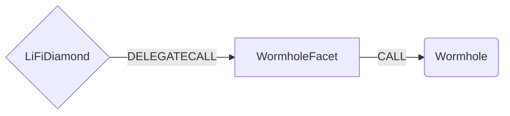

# Wormhole Facet

## How it works

The Wormhole Facet works by forwarding Wormhole (Portal) specific calls to the [Wormhole Router](https://etherscan.io/address/0x98f3c9e6E3fAce36bAAd05FE09d375Ef1464288B). All bridging is done by calling the `transferTokens` method. Currently we do not support transferring native tokens trough Wormhole. 



## Public Methods

- `function startBridgeTokensViaWormhole(LiFiData calldata _lifiData, WormholeData calldata _wormholeData)`
  - Simply bridges tokens using Wormhole
- `swapAndStartBridgeTokensViaWormhole(LiFiData calldata _lifiData, LibSwap.SwapData[] calldata _swapData, WormholeData memory _wormholeData)`
  - Performs swap(s) before bridging tokens using Wormhole

## Wormhole Specific Parameters

The methods listed above take a variable labeled `_WormholeData`. This data is specific to Wormhole and is represented as the following struct type:

```solidity
/// @param wormholeRouter The contract address of the Wormhole router.
/// @param token The contract address of the token being bridged.
/// @param amount The amount of tokens to bridge.
/// @param recipient The address of the token recipient after bridging.
/// @param toChainId The chainId of the chain to bridge to.
/// @param arbiterFee The amount of token to pay a relayer (can be zero if no relayer is used).
/// @param nonce A random nonce to associate with the tx.
struct WormholeData {
    address wormholeRouter;
    address token;
    uint256 amount;
    address recipient;
    uint16 toChainId;
    uint256 arbiterFee;
    uint32 nonce;
}

```

## Swap Data

Some methods accept a `SwapData _swapData` parameter.

Swapping is performed by a swap specific library that expects an array of calldata to can be run on variaous DEXs (i.e. Uniswap) to make one or multiple swaps before performing another action.

The swap library can be found [here](../src/Libraries/LibSwap.sol).

## LiFi Data

Some methods accept a `LiFiData _lifiData` parameter.

This parameter is strictly for analytics purposes. It's used to emit events that we can later track and index in our subgraphs and provide data on how our contracts are being used. `LiFiData` and the events we can emit can be found [here](../src/Interfaces/ILiFi.sol).

## Getting Sample Calls to interact with the Facet

In the following some sample calls are shown that allow you to retrieve a populated transaction that can be sent to our contract via your wallet.

All examples use our [/quote endpoint](https://apidocs.li.fi/reference/get_quote) to retrieve a quote which contains a `transactionRequest`. This request can directly be sent to your wallet to trigger the transaction.

The quote result looks like the following:

```javascript
const quoteResult = {
  id: '0x...', // quote id
  type: 'lifi', // the type of the quote (all lifi contract calls have the type "lifi")
  tool: 'portal', // the bridge tool used for the transaction -- wormhole is the prototol, Portal is the actual bridge.
  action: {}, // information about what is going to happen
  estimate: {}, // information about the estimated outcome of the call
  includedSteps: [], // steps that are executed by the contract as part of this transaction, e.g. a swap step and a cross step
  transactionRequest: {
    // the transaction that can be sent using a wallet
    data: '0x...',
    to: '0x...',
    value: '0x00',
    from: '{YOUR_WALLET_ADDRESS}',
    chainId: 100,
    gasLimit: '0x...',
    gasPrice: '0x...',
  },
}
```

A detailed explanation on how to use the /quote endpoint and how to trigger the transaction can be found [here](https://docs.li.fi/products/more-integration-options/li.fi-api/transferring-tokens-example).

**Hint**: Don't forget to replace `{YOUR_WALLET_ADDRESS}` with your real wallet address in the examples.

### Cross Only

To get a transaction for a transfer from 30 USDC.e on Avalanche to USDC on Binance you can execute the following request:

```shell
curl 'https://li.quest/v1/quote?fromChain=AVA&fromAmount=10000000&fromToken=USDC&toChain=POL&toToken=USDC&slippage=0.03&allowBridges=portal&fromAddress={YOUR_WALLET_ADDRESS}'
```

### Swap & Cross

To get a transaction for a transfer from 30 USDT on Avalanche to USDC on Binance you can execute the following request:

```shell
curl 'https://li.quest/v1/quote?fromChain=POL&fromAmount=12000000&fromToken=USDT&toChain=AVA&toToken=USDC&slippage=0.03&allowBridges=portal&fromAddress={YOUR_WALLET_ADDRESS}'
```
