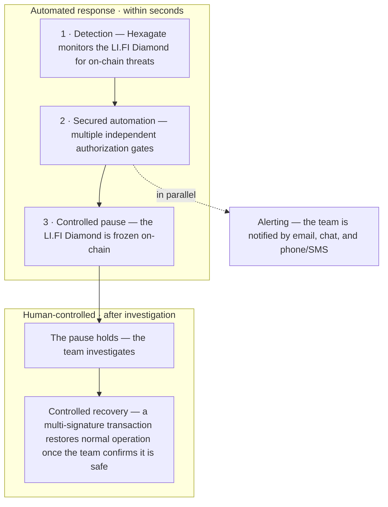

<!--
  External partner report — drafted against:
  docs/superpowers/specs/2026-06-16-emergency-pause-external-report-design.md
  This markdown is the finalized text. LI.FI branding + PDF production is the downstream step.
-->

# Production Emergency-Response Exercise

## Confirming LI.FI's Ability to Protect User Funds

*On 28 May 2026, LI.FI conducted a full end-to-end test of its automated emergency-pause
capability in live production — and confirmed it works exactly as designed.*

| | |
|---|---|
| **Prepared by** | LI.FI Smart Contract Team |
| **Exercise date** | 28 May 2026 |
| **Audience** | Partners and integrators conducting security due diligence on LI.FI |
| **Status** | Final |

---

## Executive summary

LI.FI operates an automated safeguard that can **pause the LI.FI Diamond — its core
cross-chain bridging and swapping protocol — within moments of a threat being detected**,
freezing activity to protect user funds. The LI.FI Diamond is monitored around the clock by
Hexagate, a Chainalysis company, and the emergency-pause system is designed so that this
monitoring can trigger the response **automatically**, without waiting for a human at a
keyboard.

On **28 May 2026** we tested that entire capability end-to-end, in production. The exercise
was meticulously planned around a detailed written runbook, executed under a strict
four-eyes principle, and deliberately staged so that it remained reversible at every step.

**The result: the capability works.** Threat detection, authorization, the built-in safety
stops, multi-channel team alerting, and controlled recovery all performed exactly as designed. As
intended with any rigorous exercise, we identified a small set of operational refinements —
and have since implemented all of them, further strengthening an already-working system.

---

## Why this capability matters

The LI.FI Diamond moves real user funds across chains. If it ever came under attack, the most
important defensive action is the ability to **pause it instantly** — freezing activity before
an attacker can cause harm, and buying responders time to act.

A pause capability is only meaningful if it is **fast, reliable, and continuously ready**. It
cannot depend on someone happening to be awake and online: it must be backed by continuous
monitoring that can detect a threat and trigger the response automatically, and it must be
proven under realistic conditions so there are no surprises when it matters most. This
exercise was designed to demonstrate exactly that.

---

## How the emergency response works

The response has **two distinct phases**. The first is automated and time-critical: it
detects a threat and freezes the protocol within seconds, with no human in the loop. The
second is deliberate and human-controlled: the protocol stays frozen while the team
investigates, and normal operation is restored only once the team confirms it is safe to do
so. Several independent checks must pass before the protocol is ever touched.

**Phase 1 — automated response (within seconds):**

1. **Detection.** Hexagate continuously monitors the LI.FI Diamond for anomalous or malicious
   on-chain activity.
2. **Secured automation.** A detection is handed to a secured automation pipeline (built on
   GitHub Actions) that orchestrates the response. **Multiple independent authorization checks
   must pass before anything executes**, so no single component can trigger a pause on its
   own — a deliberate defense-in-depth design.
3. **Controlled pause.** Once the checks pass, the LI.FI Diamond is paused on-chain, freezing
   activity before an attacker can cause harm.

In parallel, the team is alerted across multiple channels — email, chat, and phone/SMS
paging — so responders engage immediately, day or night.

**Phase 2 — human-controlled recovery (on the team's timeline):**

A paused protocol stays frozen; **recovery is never automatic**. The pause holds while the
team investigates and confirms it is safe to resume. Only then is normal operation restored,
through a **multi-signature recovery that no single person can perform alone**. The recovery
path is engineered and rehearsed ahead of time, so once the team authorizes it the protocol
can be brought back promptly. This separation is deliberate: the freeze protects user funds for
as long as needed, and the protocol returns to service only on an explicit human decision.

---

## How we ensured a safe, controlled exercise

Testing an emergency control in live production demands discipline. We applied several
independent layers of control:

- **A four-eyes principle, executed as a team.** The entire smart contract team, together with
  a member of the security team, ran the exercise in a single shared session — working through
  every step of the runbook together rather than any one person acting alone. Each sensitive
  action was independently verified by a second team member before and after execution, so no
  critical step could be taken, or missed, by an individual.
- **A detailed written runbook.** Every action, its expected result, and each safety check was
  documented and reviewed in advance. The team executed against the runbook step by step rather
  than improvising.
- **A deliberately staged, two-stage design** to bound any impact. We first validated the
  detection and authorization chain in a mode where **no real pause was possible**, confirming
  the alarm and approval path worked end-to-end. Only then did we run a genuine pause — and only
  on a small set of deliberately chosen, low-traffic networks.
- **Pre-staged recovery for a reversible test.** Because this was a planned exercise of a
  deliberate pause — not a response to a real threat — we prepared and pre-signed the
  multi-signature recovery transactions in advance, purely so the test was reversible within
  minutes and required no scrambling. (In a real incident, recovery is signed and executed only
  after investigation; it is never pre-authorized.)
- **Advance notice to all stakeholders**, internal and external — including our external
  auditors — so the deliberately realistic alerts were never mistaken for a real incident.

---

## What we tested and confirmed

Following the runbook, we exercised the full chain shown above and confirmed every stage
performed as designed:

- **Detection and automated dispatch** — a Hexagate monitor detected a designated on-chain
  event and initiated the response automatically, with no human trigger, exercising the exact
  automated path a real production threat detection would follow.
- **Authorization** — every independent authorization gate behaved correctly; no single
  component could act on its own.
- **Controlled execution** — the LI.FI Diamond was paused on-chain on the selected low-traffic
  networks.
- **Alerting** — the team was reached across every channel (email, chat, and phone/SMS paging),
  confirming responders would be engaged day or night.
- **Controlled recovery** — once the pause was confirmed, we restored normal operation within
  minutes using the multi-signature recovery transactions we had pre-signed for this test,
  confirming the deliberate, human-controlled exit path is fast and reliable when authorized.
  Everything returned to its pre-test state.

We also confirmed the system's **fail-safe design**: where a precondition was not met, the
safeguard correctly **declined to act rather than acting incorrectly** — precisely the
behaviour an emergency control must guarantee, and one of the most valuable assurances this
exercise produced. Throughout, an internal readiness tool verified the exact state of the
protocol on every network before, during, and after the exercise.

---

## Continuous improvement

The core value of a controlled exercise is that it surfaces operational refinements while the
stakes are low — so they are never encountered for the first time during a real incident. This
test did exactly that, and **every improvement identified has since been implemented**:

| Improvement | Status |
|---|---|
| Hardened funding checks across **all** production networks, with an automated guardrail ensuring the pause transaction is always funded. | ✅ Implemented |
| Introduced an **automated weekly readiness check** that continuously verifies the emergency-pause system is correctly configured, funded, and ready. | ✅ Implemented |
| Confirmed and hardened the direct on-chain execution path so the pause runs without delay. | ✅ Implemented |
| Refined alerting so every alert is delivered as its own distinct incident, and reviewed on-call coverage so every responder is reachable. | ✅ Implemented |
| Strengthened how operational secrets are validated, surfacing any issue well ahead of time. | ✅ Implemented |
| Formalized that a security approver is present for the full duration of every live exercise, and that external auditors are notified in advance as a required step. | ✅ Implemented |

The exercise turned a previously one-time validation into an **ongoing, automated assurance
process** — the protocol's emergency-pause readiness is now monitored continuously, not just
at test time.

---

## In closing

The most important question — *can LI.FI pause the LI.FI Diamond to protect user funds when it
matters?* — is answered **yes**. The capability was tested end-to-end in live production, under
disciplined controls, and confirmed working. The exercise both proved the core safeguard and
made it measurably stronger. LI.FI treats the security of user funds as a continuous,
evidence-based discipline, and this exercise is one part of that ongoing commitment.

---

## Appendix

### Glossary

- **LI.FI Diamond** — LI.FI's core cross-chain protocol: the on-chain smart contracts that
  power LI.FI's bridging and swapping, deployed across many networks. This report concerns the
  LI.FI Diamond specifically.
- **Emergency pause** — an on-chain control that instantly freezes activity on the protocol to
  protect user funds during a suspected attack.
- **Four-eyes principle** — a control requiring a second qualified person to independently
  verify each sensitive action, so no critical step is taken by one individual alone.
- **On-chain monitoring** — continuous, automated surveillance of smart-contract activity to
  detect threats in real time.
- **Controlled recovery** — the deliberate, human-controlled lifting of a pause. A paused
  protocol stays frozen until the team has investigated and decided it is safe to resume;
  recovery is never automatic and is never pre-authorized. Lifting the pause requires approval
  from multiple independent signers (a multi-signature scheme), so no individual can resume the
  protocol alone.

### About Hexagate

Hexagate, a Chainalysis company, is a real-time on-chain security platform that detects
threats — exploits, key compromises, governance attacks, and phishing — and can trigger
automated responses such as contract pauses. Built on Chainalysis's blockchain intelligence,
it monitors the LI.FI Diamond continuously. Learn more:
<https://www.chainalysis.com/product/hexagate/>
