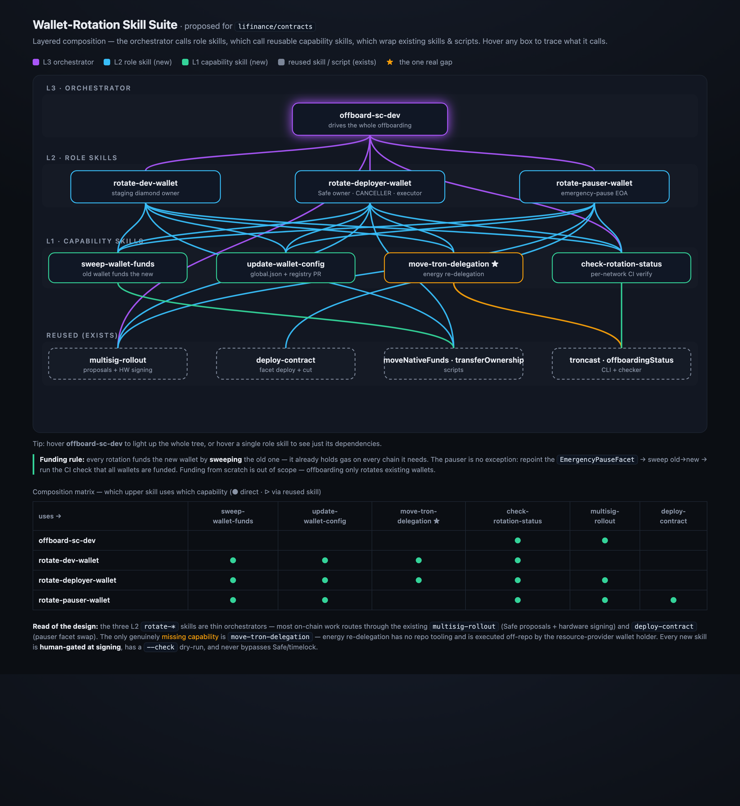

# Wallet-rotation skill suite — design & architecture

Reusable agent skills for rotating the SC-owned wallets (deployer / dev / pauser)
and orchestrating an SC-dev offboarding. Tracked in EXSC-590; motivated by EXSC-558
(the Michał offboarding), which exposed that wallet rotation was a hand-run
checklist. Goal: capture the major subtasks as composable, reusable skills so the
next rotation/offboarding is driven, not improvised.

The layered composition: an L3 orchestrator calls L2 role skills, which call L1
capability skills, which wrap existing skills (`multisig-rollout`, `deploy-contract`)
and scripts. Nothing on-chain bypasses the Safe/timelock governance path.

## Principles

- **Reuse over rebuild.** Governance changes (Safe owner swap, CANCELLER move,
  facet swap) go through the existing `multisig-rollout` + `deploy-contract`
  skills and existing scripts. New skills orchestrate; they don't reimplement
  on-chain logic.
- **Layered, extracted on real reuse.** Adopt L1→L2→L3, but an L1 capability
  skill only exists if ≥2 L2 skills (or the orchestrator) call it. No speculative
  leaves.
- **Human-gated & non-bypassing.** Secure key generation and hardware-wallet
  signing are always human steps. No skill may bypass Safe/timelock
  (`002-architecture` governance rules). Skills stop and hand off.
- **Idempotent + `--check`.** Every L1/L2 skill is re-runnable and has a dry-run /
  status mode; rotations are long and get interrupted.
- **Address discipline.** Always derive Tron base58 from the canonical EVM address
  via `bun troncast address to-base58` and cross-check; never trust `global.json`
  mid-rotation (it is inconsistent during a rotation — proven this cycle).
- **Repo convention.** Agent-agnostic repo: canonical file at
  `.agents/commands/<name>.md`, symlinked to `.cursor/` and `.claude/`. Build via
  the repo `add-rule-or-skill` skill. Never a bare `.claude/skills/**/SKILL.md`.

## Building blocks that already exist (reused, not rebuilt)

| Block | Kind | Used for |
|---|---|---|
| `multisig-rollout` | skill | Safe proposals → PR → HW signing → Slack tail (governance spine) |
| `deploy-contract` | skill | Deploy + diamondCut (pauser facet swap, Tron) |
| `send-deployer-funds` / `request-dev-funds` | skills | Funding (EVM; request-dev-funds = PR-driven, EVM+Solana) |
| `add-safe-owners-and-threshold.ts` | script | Owner swap (`--check`, `--all-networks`) |
| `moveNativeFundsToNewWallet.ts` | script | Native sweep (flag `--newWalletAddress`; sweep native LAST) |
| `fundNewWalletOnAllChains.ts` | script | Gas.zip cross-chain funding |
| `transfer-ownership-to-timelock.ts` | script | Tron diamond ownership |
| `checkOffboardingStatusPerNetwork.ts` | script | Per-network verification (EVM only today) |
| `troncast` | CLI | Tron calls + base58↔hex address conversion |
| `confirm-safe-tx.ts` / `ledger.ts` | scripts | Hardware-wallet signing |

Gaps: no Tron energy-delegation tooling; no role-rotation orchestrators; no
offboarding umbrella. EXSC-558's 1–10 sub-issue tree is effectively the
orchestrator spec.

## L1 — capability skills (each reused ≥2×)

1. **`sweep-wallet-funds`** — sweep native from old→new across chains, native LAST.
   **This is how EVERY rotation funds the new wallet** — the old wallet already
   holds gas on every chain it needs, so the bulk comes from sweeping the old
   wallet. A freshly generated wallet may still need bootstrap gas before the
   first on-chain step (e.g. `rotate-deployer-wallet` runs the sweep as Phase 1,
   before any governance change, so the new key can broadcast at all).
   Wraps `moveNativeFundsToNewWallet.ts`. Consumers: rotate-dev, rotate-deployer,
   rotate-pauser.
2. **`update-wallet-config`** — PR updating `config/global.json` role (EVM +
   `tronWallets`) + Notion registry, in the same PR that rotates the role.
   Consumers: all L2.
3. **`move-tron-delegation`** — THE GAP. Derive Tron addrs (troncast), request
   undelegate/re-delegate from the resource-provider wallet holder, verify on
   Tronscan, update `tronWallets`. Off-repo execution (Max); skill drives +
   verifies. Consumers: rotate-deployer, rotate-dev.
4. **`check-rotation-status`** — wraps `checkOffboardingStatusPerNetwork.ts` /
   the funding CI check; extend to cover Tron + pauser. Consumers: all L2 + L3
   (completeness gate).

Deliberately NOT in this suite:

- **Safe owner swap + CANCELLER move** → driven through `multisig-rollout`
  (proposal templates), not a bespoke L1 skill.
- **Fund-from-scratch (`fundNewWalletOnAllChains.ts`, Gas.zip)** → out of scope.
  Offboarding only *rotates* existing wallets, which always inherit gas by
  sweeping the predecessor. A brand-new wallet with no predecessor is a separate,
  adjacent concern.

## L2 — role-rotation skills ("major subtasks")

### `rotate-dev-wallet` (staging owner)

receive+verify new EVM addr → `sweep-wallet-funds` (old dev → new; this funds the
new wallet) → transfer staging diamond ownership (old dev → new dev) →
`move-tron-delegation` → `update-wallet-config` → `check-rotation-status`.
Human gate: key gen, any signing.

### `rotate-deployer-wallet` (safeOwners[0] + CANCELLER + prod timelock executor)

`sweep-wallet-funds` old→new **first** (bootstraps the new deployer's gas so it can
execute proposals — no external funding needed) → `multisig-rollout`: swap Safe
owner (old→new) + move CANCELLER role → Tron owner swap
(`transfer-ownership-to-timelock.ts`) + `move-tron-delegation` →
`update-wallet-config` → decommission old → `check-rotation-status`.
Heaviest governance → leans on multisig-rollout.

### `rotate-pauser-wallet` (emergency-pause EOA; immutable, no setter)

Kept simple — the action window is short, so a sub-second per-chain coverage gap is
acceptable: repoint `pauserWallet()` by deploying a new `EmergencyPauseFacet` (new
pauser in constructor) + `diamondCut` on every diamond incl. Tron (via
`deploy-contract`/`multisig-rollout`) → `sweep-wallet-funds` (old pauser → new) →
`check-rotation-status` (CI check that all wallets are funded) → rotate CI pauser
secret + re-verify pause flow (`verifyEmergencyPauseReadiness.yml`; partly outside
contracts) → `update-wallet-config`.

## L3 — orchestrator

### `offboard-sc-dev`

Inputs: departing person + wallets they held, replacement signer address.
Drives: add new Safe signer + remove departing (multisig-rollout) →
`rotate-deployer-wallet` → `rotate-dev-wallet` → `rotate-pauser-wallet` →
shared-secret rotation checklist → knowledge transfer. Sequences per dependency
(generate+fund new wallets is BLOCKING first). Uses `check-rotation-status` as the
completeness gate. Effectively templatizes EXSC-558.

Critical path (from EXSC-558): generate+fund (BLOCKING) → deployer → dev/pauser,
secrets rotation in parallel from day 1.

## Cross-cutting gates

- All on-chain owner/role/pauser changes → `multisig-rollout` (proposals + HW sign).
- High-stakes-drafting gates on every generated proposal / config PR.
- Pre-PR: `self-review-pass` before any PR; cloud CodeRabbit in GitHub CI is the review backstop.
- Per-session worktree for the build; never touch the primary clone.

## Decisions

1. **Funding = sweep.** Every rotation funds the new wallet by sweeping the old
   one (it already holds gas on every chain it needs). Fund-from-scratch
   (`fundNewWalletOnAllChains.ts`) is out of scope — offboarding only rotates
   existing wallets.
2. **Orchestrator v1 is execute-only.** `offboard-sc-dev` assumes the Linear
   ticket tree already exists (modeled on EXSC-558) and runs the rotations;
   templatized ticket-tree creation is a fast-follow.
3. **One skill per role, staging vs prod picked by which delegate it calls.**
   Each rotate-* skill routes staging/testnets through `deploy-contract` and
   production through `multisig-rollout` (mirroring how those two skills
   already split staging/prod) — it is not a `--production` flag on the
   rotate-* skills themselves; their CLI surface is `--new-address [--check]`.
4. **Pauser CI-secret rotation is partly outside `contracts`.** The skill
   coordinates and re-verifies the pause flow (`verifyEmergencyPauseReadiness.yml`)
   but cannot fully automate the CI side — flagged, not faked.

## Follow-ups

- Generalize the hardcoded `script/tasks/temp/checkOffboardingStatusPerNetwork.ts`
  into the flag-driven `checkRotationStatusPerNetwork.ts` that `check-rotation-status`
  documents (ships with its own tests).
- Templatize the Linear ticket-tree creation in `offboard-sc-dev` (v2).
